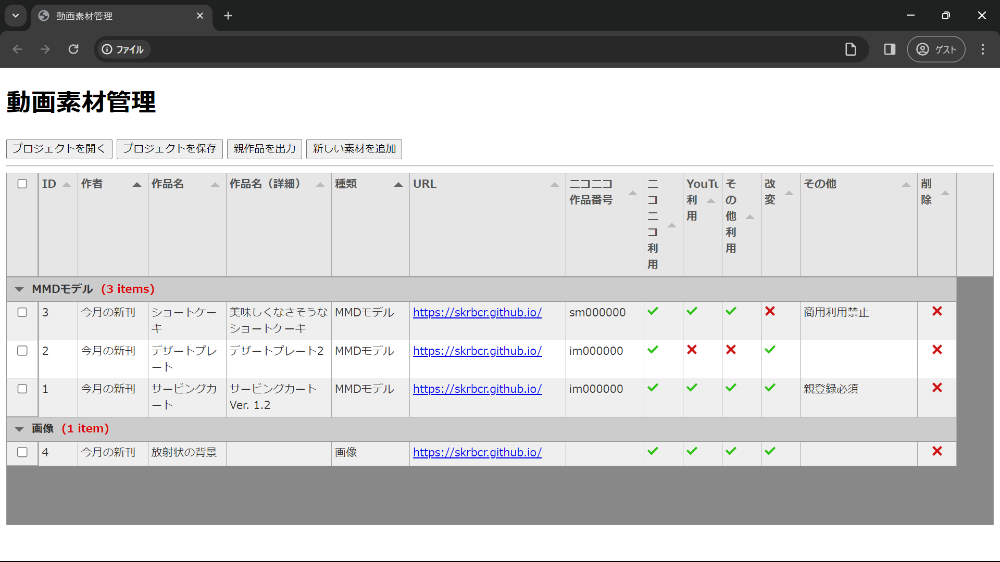
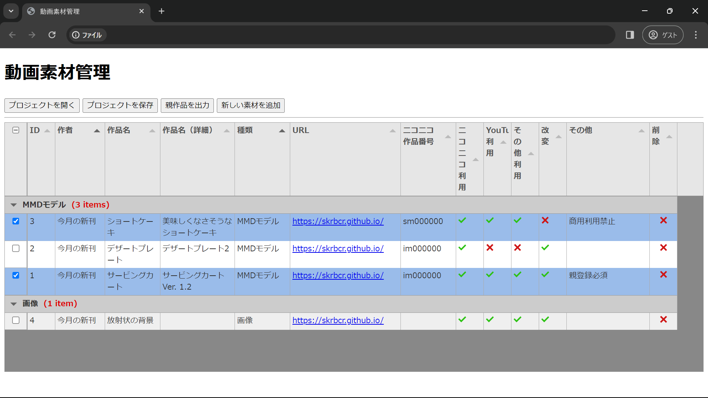

# material_manager
動画の素材リストを作成するソフトウェア（？）です。ブラウザで動きます。

## 機能
動画などで使う素材をリストアップして保存することができます。

ダウンロードした素材はとりあえずリストに入れておいて、実際に使用した素材をチェックボックスで選択するという使い方ができます。この状態で「プロジェクトを保存」すればリストと共に選択状況も保存されます。

「親作品を出力」すると、選択した素材のニコニコ番号（im000000, sm000000 など）をテキストファイルに書き出すことができます。

## インストール＆使い方
1. [ここ](https://github.com/skrbcr/material_manager/archive/refs/heads/main.zip) からダウンロード、展開。
2. `index.html` をブラウザ（Google Chrome, Microsoft Edge など）で開く

## 注意！
1. 動作確認は Google Chrome, Microsoft Edge のみで行っています。使用している機能のため、Firefox などでは機能しない可能性が高いです。
2. ライセンスは MIT License です。そのため、無保証となります。
3. 保存せずにブラウザを閉じたり更新したりしても警告が出ません。**保存していないデータは消失**します。現在、警告を発するように機能改善を目指しています。
4. ライブラリを読み込むためにインターネットに接続されている必要があります。

## Special Thanks
高機能な表は [Tabulator](https://tabulator.info/) を用いて実現しています。

