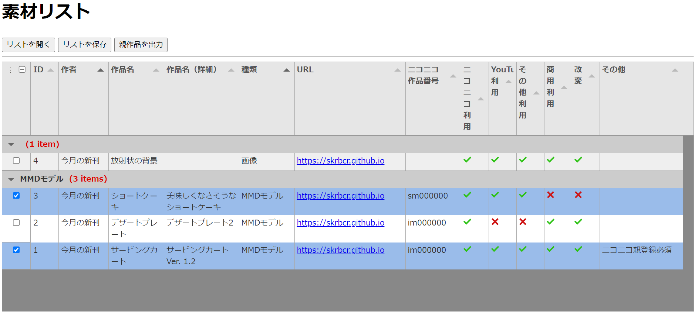

# material_manager
動画などで使う素材の規約などを一覧にまとめて表示するWebアプリケーション的なものです。ニコニコの親登録で便利な、使用した作品の番号をまとめて出力する機能も。

## 機能
動画などで使う素材をリストアップ、リストは保存することができます。


使用した素材にチェックを入れておけば、どの素材を使用したか迷いません。この状態で「プロジェクトを保存」すればリストと共に選択状況も保存されます。



さらに、「親作品を出力」すると、選択した素材のニコニコ番号（im000000, sm000000 など）をテキストファイルに書き出すことができます。

```
sm000000 im000000
```

## インストール＆使い方
### インターネット上で使う
1. [こちら](https://skrbcr.github.io/material_manager/) にアクセス

### ローカルにダウンロードして使う
1. [こちら](https://github.com/skrbcr/material_manager/archive/refs/heads/main.zip) からダウンロード、展開。
2. `index.html` をブラウザ（Google Chrome, Microsoft Edge など）で開く

## 注意！
1. 動作保証は Google Chrome, Microsoft Edge のみです。Firefox などでは機能しない可能性が高いです（[詳細](https://developer.mozilla.org/ja/docs/Web/API/Window/showSaveFilePicker#%E3%83%96%E3%83%A9%E3%82%A6%E3%82%B6%E3%83%BC%E3%81%AE%E4%BA%92%E6%8F%9B%E6%80%A7)）。
2. ライセンスは MIT License です。そのため無保証となります。
3. ライブラリを読み込むためにインターネットに接続されている必要があります。

## Special Thanks
高機能な表は [Tabulator](https://tabulator.info/) を用いて実現しています。絵文字に [Font Awesome](https://fontawesome.com/) を利用しています。

