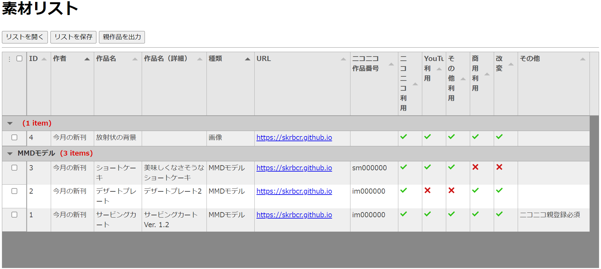

# マニュアル

## 素材を登録

- **素材の情報を登録**：
  - ID：本アプリが内部で使用する素材の通し番号です。気にしないで OK です。
  - 作者～：素材の情報を必要に応じて入力してください。セル上で左クリックすると編集できます。
- **素材の追加・削除**：行（素材）の上で右クリックすると「素材を追加」または「素材を削除」できます。
- **素材の選択**：各行（素材）の左端にあるチェックボックスを用いることで、あなたの作品で使用している素材を選択することができます。これは次節の「親作品の出力」でも使う機能です。

## 保存機能

表の上にあるボタンです：

- **リストを保存・開く**：「リストを保存」から素材リスト（＝表）を保存できます。「リストを開く」から保存したリストを開くことができます。素材の選択状況も保存・復元されます。
- **親作品を出力**：はニコニコ動画向けの機能です。選択した素材のニコニコ作品番号（sm000000, im000000 みたいな）をまとめてテキストファイルに出力できます。
- **リストをテキストに出力**：選択した素材リストを、書式を指定してテキストファイルに出力します。書式：
	- `$author$`：作者
	- `$name$`：作品名
	- `$url$`：URL
	- `$nico$`：ニコニコ作品番号
例えば`$name$：$author$`として「出力」すると「（作品名）：（作者）」の形式で選択した素材一覧が作成されます。

## 便利機能

- 左上の「︙」を押すと、列の表示・非表示を切り替えられます。非表示にした内容も保存されるので安心してください。
- **ショートカットキー**：Tabulator の機能により、ショートカットキー（ホットキー）が使えるみたいです：
  - `Ctrl` + `Z`：操作を取り消す
  - `Ctrl` + `Y`：操作を取り消すを取り消す
  - その他は調査中
